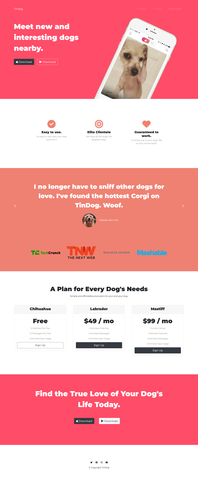

# tindog-website-clone

TinDog Starting Files

- [Overview](#Overview)
- [Links](#Links)
- [Screenshot](#Screenshot)
- [My process](#my-process)
- [Built with](#built-with)
- [Useful Resources](#useful-resouces)

## Overview

This is a clone website built following th instructions of a Udemy course by Angela Yu that I took to improve my skills.

## Links

- Live site url: [Tindog Website](https://dytoma.github.io/tindog-website-clone/)

## Screenshot

This is the screenshot of the entire website.

## My process

Following the instructions of the lecturer a bit of research mostly on MDN docs I was able to design this website and come out with this prototype.

## Built with

- [Bootstrap](https://getbootstrap.com/docs/4.6/getting-started/introduction/)

## Useful Resources 

- [MDN docs](https://developer.mozilla.org/en-US/)
- [W3school](https://www.w3schools.com/)
